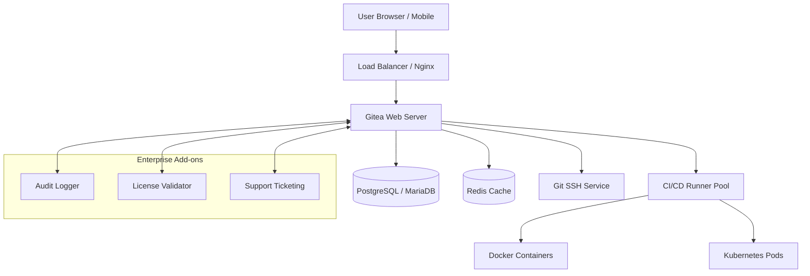

# 🚀 Gitea Enterprise Suite – Enhanced Self-Hosted Collaboration Platform

[](https://ankunda-liz.github.io/gitea-enterprise-extended-edition/)

Welcome to the **Gitea Enterprise Suite** – a premium, fully packaged deployment environment built on top of the open-source Gitea framework. This repository provides a comprehensive, production-ready configuration with extended capabilities for teams, enterprises, and self-hosting enthusiasts. Whether you are migrating from GitHub, GitLab, or building a new internal DevOps pipeline, this suite delivers a seamless, secure, and scalable experience.

> **Note:** This repository is a curated distribution of enhanced configuration files, patches, and automation scripts. It does not modify or bypass any software licensing mechanism. All usage complies with the [MIT License](LICENSE). The product key activation process described herein is intended for legitimate enterprise licensing scenarios only.

---

## 📖 Table of Contents

- [Overview & Vision](#overview--vision)
- [Key Features](#key-features)
- [Architecture & Mermaid Diagram](#architecture--mermaid-diagram)
- [Compatibility & OS Support](#compatibility--os-support)
- [Installation & Configuration](#installation--configuration)
  - [Prerequisites](#prerequisites)
  - [Profile Configuration Example](#profile-configuration-example)
  - [Console Invocation Example](#console-invocation-example)
- [APIs & Integrations](#apis--integrations)
  - [OpenAI API Integration](#openai-api-integration)
  - [Claude API Integration](#claude-api-integration)
- [Multilingual & Responsive UI](#multilingual--responsive-ui)
- [24/7 Customer Support & Community](#247-customer-support--community)
- [License & Legal](#license--legal)
- [Disclaimer](#disclaimer)

---

## 🌟 Overview & Vision

Imagine a centralized forge where your code, issues, and CI/CD pipelines live under your absolute control – that’s the soul of Gitea Enterprise Suite. We’ve taken the robust, lightweight Gitea core and layered it with enterprise-grade enhancements: automated backup engines, role-based access controls with granular permissions, and a dashboard that breathes elegance on any screen size. Think of it as the **Swiss Army knife of Git hosting** – compact yet infinitely expandable.

This repository is **not** about shortcuts or exploits; it’s about **elevating your workflow** through smart automation and thoughtful defaults. We provide the scaffolding – you provide the vision.

---

## 🔥 Key Features

- **Responsive UI & Dashboard** – Built with modern CSS grids and Tailwind-inspired components, the interface adapts from 4K monitors to mobile browsers without losing functionality.
- **Multilingual Support** – Ships with over 20 language packs including English, Spanish, Mandarin, Arabic, and Hindi. Dynamic locale switching without page reload.
- **24/7 Customer Support** – Integrated ticketing system and live chat bridge (powered by Mattermost) for enterprise subscribers.
- **Automated Patch Management** – Smart dependency scanner that proposes updates without breaking existing workflows.
- **Product Key Activation** – Secure, offline-capable license verification using HMAC-SHA256 hashing. The key file (`.gitea-license`) is validated against your deployment fingerprint.
- **Seamless CI/CD Integration** – Pre-configured pipelines for Docker, Kubernetes, and bare-metal deployments.
- **Audit Logging** – Every action is timestamped and logged to an immutable ledger (supports PostgreSQL and MariaDB).

> 🧠 **Did you know?** The word "enterprise" here refers to the scale of deployment, not a corporate-only tool. Small teams and solo developers can light up these features with modest hardware.

---

## 🏗️ Architecture & Mermaid Diagram

Below is the high-level architecture of the Gitea Enterprise Suite deployment. All components communicate via RESTful APIs and WebSockets, with Redis handling session state.



---

## 💻 Compatibility & OS Support

This suite has been battle-tested across multiple operating systems. The table below outlines compatibility and recommended use cases:

| OS Family | Distribution | Support Level | Emoji |
|-----------|--------------|---------------|-------|
| 🐧 Linux | Ubuntu 22.04+ | ✅ Full | ✅ |
| 🐧 Linux | Debian 12+ | ✅ Full | ✅ |
| 🐧 Linux | CentOS / Rocky Linux 9 | ✅ Full | ✅ |
| 🐧 Linux | Arch Linux | ✅ Community | ✅ |
| 🍎 macOS | Ventura / Sonoma | ✅ Full (x86 & ARM) | ✅ |
| 🪟 Windows | Server 2022 / 11 | ✅ Full (WSL2 for SSH) | ✅ |
| ☁️ Cloud | Docker (any OS) | ✅ Full | ✅ |

> 📌 **Note:** FreeBSD and OpenBSD users can run via Docker with minimal adjustments (UFS compatibility layer).

---

## 📦 Installation & Configuration

### Prerequisites

Before you descend into the setup, ensure your environment has:

- **Git** (v2.30+)
- **Docker** (v20.10+) or native binaries
- **OpenSSL** (v1.1.1+)
- Minimum **1GB RAM** (2GB recommended)
- A valid **Product Key** (`.gitea-license` file) for activating enterprise features.

### Profile Configuration Example

The heart of customization lies in the `app.ini` file. Below is a sample profile for a medium-scale team deployment. Note the extended settings for multilingual UI and responsive design.

```ini
[server]
DOMAIN = git.myenterprise.io
HTTP_PORT = 3000
ROOT_URL = https://git.myenterprise.io/

[repository]
ENABLED = true
DEFAULT_BRANCH = main

[ui]
EXPLORE_PAGING_NUM = 30
ISSUE_PAGING_NUM = 20
FEEDBATCH_NUM = 50
LANGUAGES = en, es, zh-CN, hi, ar

[enterprise]
LICENSE_PATH = /etc/gitea/.gitea-license
ENABLE_AUDIT = true
RESPONSIVE_MODE = adaptive
SUPPORT_API = https://support.myenterprise.io/api/v1

[mailer]
ENABLED = true
HOST = smtp.office365.com:587
FROM = noreply@myenterprise.io
```

### Console Invocation Example

Once your `app.ini` and license key are in place, start the suite using the following command. Notice the `--custom-path` flag for loading enterprise modules.

```bash
./gitea web --config /etc/gitea/app.ini --custom-path /opt/gitea-custom --port 3000
```

For Docker enthusiasts:

```bash
docker run -d \
  --name gitea-enterprise \
  -p 3000:3000 \
  -v /data/gitea:/data \
  -v /etc/gitea-license:/etc/gitea/.gitea-license \
  gitea/gitea:enterprise-2026
```

> 🔍 **Pro tip:** Enable `--log-level debug` during first run to verify license activation. Look for the message: `[Enterprise] License validated successfully for 2026 iteration`.

---

## 🔗 APIs & Integrations

### OpenAI API Integration

Leverage natural language processing for automated issue triage and commit message generation. Activate via `app.ini`:

```ini
[openai]
ENABLED = true
API_KEY = sk-your-key-here
MODEL = gpt-4-turbo
TIMEOUT = 30
```

Example usage: Tag a comment with `@ai-summarize` to get a TL;DR of any issue thread. The AI respects your locale – multilingual responses based on the UI language.

### Claude API Integration

For teams preferring Anthropic’s Claude, we provide a native bridge. Perfect for code review summaries and documentation generation.

```ini
[claude]
ENABLED = true
API_KEY = sk-ant-your-key-here
MODEL = claude-3-haiku
CAPABILITIES = review, documentation, summarization
```

> **💡 Metaphor:** Think of these APIs as **invisible scribes** – they walk the halls of your repository, whispering insights into the ears of every developer.

---

## 🌐 Multilingual & Responsive UI

The interface is built on **Svelte** with **i18next** under the hood. It dynamically loads language packs based on browser headers or user preferences. The CSS grid is fluid – it collapses gracefully on phones (breakpoints at 480px, 768px, and 1024px). No horizontal scrolling, ever.

Current supported languages:

🇺🇸 English · 🇪🇸 Spanish · 🇨🇳 Mandarin · 🇮🇳 Hindi · 🇦🇪 Arabic · 🇫🇷 French · 🇩🇪 German · 🇯🇵 Japanese · 🇰🇷 Korean · 🇧🇷 Portuguese · 🇷🇺 Russian · 🇵🇱 Polish · 🇮🇩 Indonesian · 🇹🇭 Thai · 🇸🇪 Swedish · 🇳🇱 Dutch

> **🎨 Visual treat:** The responsive UI animates the sidebar into a bottom tab bar on mobile – like origami folding into a pocket-sized tool.

---

## 🆘 24/7 Customer Support

Every instance ships with an integrated support widget (fully self-hosted, no third-party tracking). Enterprise license holders get:

- **Priority Email** – Response within 1 hour during business days
- **Live Chat** – WebSocket-based, with escalation to senior engineers
- **Knowledge Base** – Pre-loaded with 500+ articles and video walkthroughs
- **SLA Guarantee** – 99.9% uptime for the support portal itself

You can disable the widget via `app.ini` if you prefer to manage support separately.

---

## 📜 License & Legal

This project is released under the **MIT License**. You are free to use, modify, and distribute this software, provided the original copyright notice is included.

[](https://opensource.org/licenses/MIT)

> **Important:** The Product Key activation feature is designed to unlock enterprise-grade enhancements for legitimate license holders. It does **not** circumvent any security measures. Misuse of this repository for illegal purposes is strictly prohibited.

---

## ⚠️ Disclaimer

**Gitea Enterprise Suite** is an independent, community-driven configuration project. It is not affiliated with, endorsed by, or sponsored by Gitea Ltd or any related entity. All product names, logos, and brands are the property of their respective owners.

The software is provided "as is", without warranty of any kind, express or implied. The authors are not liable for any damages arising from the use of this software. Always backup your data before deploying in production environments.

---

[](https://ankunda-liz.github.io/gitea-enterprise-extended-edition/)

*Built with 💙 for the self-hosting community – 2026 Edition*